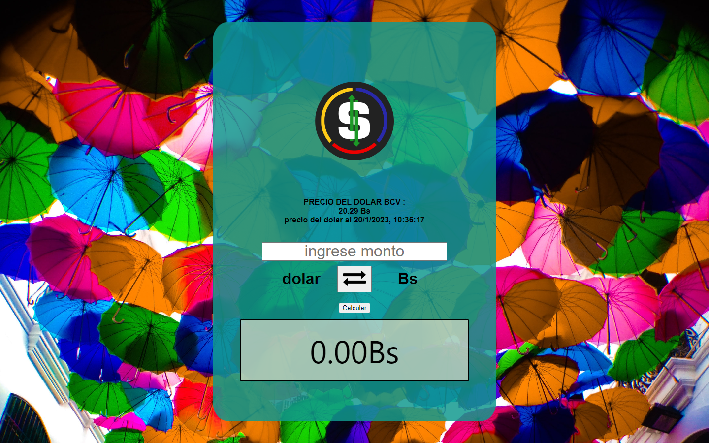

# React ⚛️  — 

# App conversion de USD a Bs y viceversa

En esta app se trabajo bajo la libreria react js y las peticiones a la api se realizaron con axios .

Los estilos se dieron con bootstrap 5.

La peticion a la api es con un post lo que fue gran practiica ya que veniamos acostumbrado a realizarlas con peticiones get.

Este proyectoo se puede arrancar desde la acarpeta root con :

### `npm start`

la app correra desde .\
Open [http://localhost:3000](http://localhost:3000) para verla en tu navegador .

# Captura del proyecto

# Scanear el codigo para bajar y instalar la App en su movil

